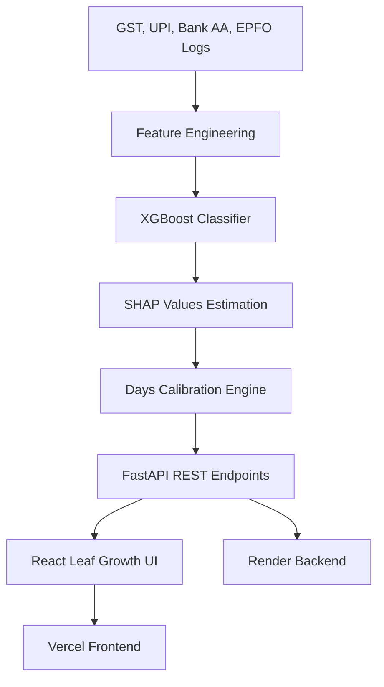

# Din — AI-Powered MSME Financial Health Card

[](https://fastapi.tiangolo.com/)
[](https://react.dev/)
[](https://tailwindcss.com/)
[](https://aws.amazon.com/)
[](https://xgboost.readthedocs.io/)
[](https://shap.readthedocs.io/)

**Din** is an AI engine that reads a small business's financial pulse from its GST filings, UPI payments, bank statement data (via Account Aggregator), and EPFO records. Instead of providing a static, backward-looking credit score, Din outputs a **"days until credit-ready" countdown** and recommends specific ranked actions that directly shrink that countdown.

Developed as our submission for the **IDBI Bank National Hackathon 2026** (Track 3: AI-Powered MSME Financial Health Card).

---

## 🔗 Live Links

* **Live Demo Frontend**: [https://naadi-din-git-main-gaurav-atvercel.vercel.app](https://naadi-din-git-main-gaurav-atvercel.vercel.app)
* **Backend API Documentation**: [https://naadi-din.onrender.com/docs](https://naadi-din.onrender.com/docs)

---

## 📌 Problem Statement

Formal credit access remains a significant bottleneck for Indian MSMEs. Traditional credit scoring models are backward-looking and penalize small businesses for compliance lags, buyer concentration risk, or seasonal cashflow swings. MSMEs are often left in the dark about *why* they were rejected or *what* exact steps they need to take to qualify for formal bank loans.

---

## 💡 Our Solution: "A Countdown, Not a Score"

Din shifts the paradigm from judgment to action. It translates complex machine-learning risk factors into a simple, intuitive **Leaf Growth Ring Countdown**. 
* **Dynamic Calibration**: Calculates the exact number of days remaining (from 7 to 180 days) before the business qualifies as "Credit Ready."
* **Ranked Action Cards**: Translates negative model drivers into high-impact, actionable recommendations (e.g., stabilizing payroll or digitalizing sales).
* **Direct Countdown Impact**: Wiping out a deficiency directly subtracts days from the countdown in real-time.

---

## 🛠️ Key Features

* **Leaf Growth Ring Dial**: A MongoDB-inspired custom visualization that fills smoothly from sprout green to vivid forest green as the business grows toward credit readiness.
* **SHAP Explainability Panel**: Operationalizes machine-learning SHAP values into readable business health metrics (classified under "Working For You" vs "Action Areas").
* **What-If Score Simulator**: An interactive slider allowing MSME owners to simulate how reducing buyer concentration risk impacts their loan-readiness timeline.
* **Product Compare View**: Allows MSMEs to benchmark their compliance metrics against industry peers and view tailored loan/credit products matching their readiness.
* **RM Portfolio Dashboard**: A comprehensive management interface for Bank Relationship Managers to monitor multiple MSME clients, evaluate aggregate compliance trends, and access generated reports.
* **PDF Loan-Readiness Reports**: Generates formal compliance certificates and summaries backed by secure storage.
* **Session-Scoped Sandboxing**: Full session isolation using browser-persisted sandbox states so multiple judges can test the 6 default MSME profiles simultaneously without polluting global baseline data.
* **Reset Demo & Welcome Badges**: A utility action allowing users to reset scenarios back to baseline within their current browser session, combined with welcome-back badges for returning visitors.

---

## 💻 Tech Stack

| Category | Technologies Used |
|---|---|
| **Frontend** | React (Vite), TailwindCSS, Framer Motion (for physics-based organic animations), Recharts |
| **Backend** | FastAPI (Python), Uvicorn (ASGI web server) |
| **AI / ML** | XGBoost (XGBClassifier model with 91.67% accuracy), scikit-learn, SHAP (Shapley Additive exPlanations) |
| **Data Generation** | Faker (Python-based synthetic financial data engine) |
| **Database** | SQLite (for session-scoped sandbox tracking and caching) |
| **AWS Services** | Amazon S3 (PDF report storage), Amazon Bedrock (generative LLM for compiling financial stories) |
| **Deployment** | Vercel (Frontend), Render (Backend services) |

---

## 🏗️ System Architecture



1. **Ingestion & Feature Engineering**: Reads transactional signals (filing rates, settlement volume slopes, cashflow swings, payroll consistency).
2. **Predictive Modeling**: The XGBoost classifier calculates the probability of credit readiness.
3. **SHAP Interpretation**: The SHAP pipeline extracts precise feature contribution values, categorizing positive and negative drivers.
4. **Days Calibration**: Maps SHAP gap magnitudes deterministic-heuristically to a countdown of $7$ to $180$ days.
5. **Interactive UI**: Framer Motion renders the leaf growth ring animation dynamically as the user treats compliance actions.

---

## 👥 Team

* **Gaurav Sharma** — *Backend Development, Cloud Deployment & Infrastructure*
  * Built the FastAPI backend, XGBoost model training, SHAP explainability pipeline, and days-to-ready calibration logic.
  * Set up AWS integrations (S3 for report storage, Bedrock for AI-generated insights).
  * Handled full deployment: Render (backend hosting), Vercel (frontend hosting), and DevOps configuration.

* **Brijesh Makwana** — *Frontend Development & Product Architecture*
  * Designed and built the complete frontend experience (Onboarding, Dashboard, Ready state, Compare view, Portfolio view).
  * Owned the product's visual design system and overall information architecture.
  * Led UX decisions on how the countdown/action-card experience should feel to an MSME owner.

---

## 🚀 How to Run Locally

### 1. Backend Setup
Navigate to the backend directory, activate the virtual environment, install requirements, and run Uvicorn:
```bash
cd backend
python -m venv venv

# Windows (PowerShell)
.\venv\Scripts\Activate.ps1
# Linux / macOS
source venv/bin/activate

pip install -r requirements.txt
python -m uvicorn app.main:app --reload
```
The API documentation will be available locally at `http://localhost:8000/docs`.

### 2. Frontend Setup
Navigate to the frontend directory, install dependencies, and launch Vite dev server:
```bash
cd frontend
npm install
npm run dev
```
The client dashboard will be available locally at `http://localhost:5173`.

---

## 🔮 Future Vision (Roadmap)

* **Multi-Language Support**: Incorporate regional Indian languages (Hindi, Marathi, Gujarati, Tamil, etc.) to increase accessibility for rural merchants.
* **Proactive Nudges (Email, SMS & WhatsApp)**: Send automated SMS, email, and WhatsApp notifications to MSME owners, reminding them of upcoming GST deadlines or payroll consistency milestones to keep them on track for credit readiness.
* **Production Consent Integrations**: Transition from simulated inputs to live API integrations with the GSTN portal, Account Aggregator framework, and EPFO systems.
* **OCR Document Ingestion**: Support scanning and parsing physical ledger books and non-digital invoices using OCR models.
* **Lender Matchmaking Engine**: Directly route credit-ready MSMEs to IDBI Bank’s digital credit underwriting systems for instant loan disbursals.

---

## ⚖️ License & Acknowledgments

This project was built for and presented at the **IDBI Bank National Hackathon 2026**. All rights reserved by the development team. Special thanks to the hackathon organizers, mentors, and jury members.
